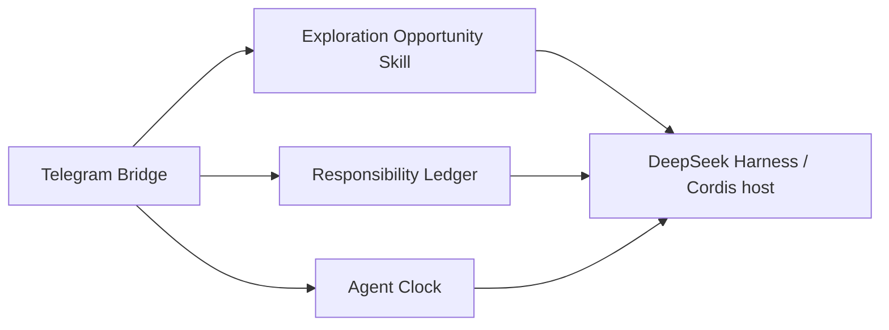

# dsh-plugins: Experimental DeepSeek Harness Plugins and Skill

[中文](README.md)

This is an experimental, personal collection of plugins and one Skill the author built for their own use of **DeepSeek Harness (DSH)**. They address ordinary situations: continuing a conversation with a home Harness from Telegram while away; sending a link and wanting one verified reason it may be worth a closer look; keeping a genuinely interesting topic for later exploration; having an agent do something every hour and report back; or tracking a long-running responsibility without losing today's work.

The repository evolves around the author's own needs. It makes **no promise of compatibility, long-term maintenance, timely support, or suitability for anyone else's production environment.** You are welcome to read and study the source; until the author explicitly publishes a license, obtain authorization before copying, modifying, or distributing it. Users are responsible for their own use, deployments, and consequences.

> The display names below are only for recognition and search in this README. The adjacent directory and component type are the real code identifiers. No API, package name, or Skill name has been changed.

## Overview

| Display name | Actual directory / type | When it helps | What changes after installation | Main boundary |
| --- | --- | --- | --- | --- |
| **Telegram On-the-Go / Telegram 随身入口** | [`telegram-gateway`](telegram-gateway) / `@deepseek-ai/dsh-telegram-gateway` | You are away from home and want to continue a Harness conversation with one Telegram message. | The bot feeds text into one fixed session and replies through ordinary Telegram MarkdownV2 messages, retaining partial quotes and reactions—without repeatedly editing streaming fragments. | Text only; needs Telegram credentials and an allowed chat ID; not a multi-bot or media gateway. |
| **Assistant Responsibility Desk / 私人助理责任台** | [`dsh-assistant`](dsh-assistant) / `@deepseek-ai/dsh-assistant` | You want an assistant to keep watching one thing without displacing what you are doing or have delegated. | It keeps focus, delegation, and monitoring separate, survives restart with the responsibility context, and reports back when a result arrives. | Not a full task list or a general workflow platform. |
| **Scheduled Agent / 定时 Agent** | [`dsh-cron`](dsh-cron) / `@deepseek-ai/dsh-cron` | You want an agent to check something hourly or prepare something daily without leaving a Web page open. | A separate session wakes on schedule, does the work, and can deliver the result to Telegram. | Starts unattended agents; you own side effects, cost, and duplicate-run boundaries. |
| **Exploration Opportunity / 探索机会** | [`skills/explore-opportunity`](skills/explore-opportunity) / Skill | You drop a sentence or link and want the most interesting mechanism first, then retain it only if it truly catches your interest. | The agent uses the host's existing search, Web, file, or Shell capabilities for a quick check and gives one hook; only an explicit reaction updates `EXPLORE.md`. | Adds no browser, network isolation, or background task; follow-up count alone never retains an item. |



The diagram shows code-level collaboration, not a requirement to install everything together. The host discovers the Exploration Opportunity Skill semantically, and the Skill coordinates search, Web, file, or Shell tools the agent already has.

## Public scope and prerequisites

This repository is source reference, not a collection of published installable packages or Skills: it has no root `package.json`, unified install script, published npm tarball, or automatic activation manifest. Each plugin directory has its own `package.json`, declares DSH/Cordis peer dependencies, and is currently versioned `0.1.0-rc.*`. Building or testing requires:

- A compatible DeepSeek Harness source checkout that can provide `@deepseek-ai/*` and Cordis dependencies. This repository does not pin a compatible Harness version.
- Node.js, pnpm, TypeScript/`tsc`, `tsdown`, and Vitest supplied by that compatible development environment.
- For Telegram plugins, `TELEGRAM_BOT_TOKEN` and `TELEGRAM_ALLOWED_CHAT_ID` in a credential provider. Never put real values in configuration, `.env`, test fixtures, or commits.
- For Exploration Opportunity, a host that discovers and loads Skills and lets the agent maintain `EXPLORE.md` in the current workspace. The Skill itself adds no Web or browser tool.

There is therefore no trustworthy one-line install command. Integrate Cordis plugins in isolation and place Skills in a host-discoverable directory. This repository does not claim that `dsh plugin add`, npm installation, or every DSH version will work directly.

### Minimal configuration shapes

The following are **object shapes passed to `apply()`**, not a specific DSH profile-file syntax. Credential fields are deliberately omitted for the host credential provider to resolve; angle-bracket text is a placeholder only.

```ts
// Telegram Bridge: token / allowedChatId come from the credential provider.
{ sessionId: 'session-telegram', cwd: '<workspace-directory>' }

// Responsibility Ledger: choose either the Web manager or Telegram delivery role.
{ mode: 'web' }
{ mode: 'telegram', telegramParentSessionId: 'session-telegram' }

// Agent Clock: manager registers tools; scheduler runs due jobs.
{ mode: 'manager' }
{
  mode: 'scheduler', pollIntervalMs: 10_000, maxConcurrent: 3,
}

```

Telegram Bridge, Responsibility Ledger, and Agent Clock ask the credential provider for Telegram credentials; do not put a token or chat ID directly into a source-controlled object. Exploration Opportunity has no `apply()` configuration; it only guides use of the host's existing tools.

## Component behavior and limits

### Telegram On-the-Go / Telegram 随身入口

When you are away, you may want to continue a conversation with your home Harness by sending one Telegram message, instead of opening a remote browser. With `telegram-gateway`, the bot feeds text into one fixed session and returns complete replies through ordinary `sendMessage` calls after Telegram MarkdownV2 conversion; partial quotes and reactions remain available, but you do not get a half-sentence repeatedly edited while the model streams.

- Validates bot credentials and accepts messages only from the configured chat ID.
- Keeps one stable session so the next message continues the existing context.
- Sends everyday text through ordinary `sendMessage` plus Telegram MarkdownV2, retaining partial quotes, reactions, complete interim messages, and chunked final messages.
- Never shows `assistant/chunk` token fragments and never edits a message after it has been sent.
- Falls back once to plain text with the same reply parameters only after Telegram explicitly rejects formatting as non-retryable; it does not resend after 429/5xx, timeout, or another ambiguous result.
- Does not handle media, files, commands, multiple bots, or multi-tenancy; deployers still need to test network and duplicate-delivery behavior.

### Assistant Responsibility Desk / 私人助理责任台

You might ask an assistant to keep watching a long-running update while you work on something else or delegate another task. Those responsibilities should not knock each other out. With `dsh-assistant`, a restart still leaves the assistant able to tell who owns each responsibility, whether it was paused, where it got to, and where to report when there is a result.

- Tracks one user focus (`focus`) alongside multiple `delegated` tasks and `monitor` responsibilities.
- Binds a continuable child agent to each responsibility, including pause and resume of that same responsibility.
- Records progress and reminders and uses one terminal outbox to avoid duplicate delivery.
- Telegram mode schedules and delivers; Web mode only observes the responsibilities it knows about.
- It is not your complete task list, an approval flow, a general queue, or an exactly-once guarantee for external writes.

### Scheduled Agent / 定时 Agent

If you want an agent to check information every hour or prepare something every day, you should not have to leave a Web page open waiting for it. With `dsh-cron`, a separate session wakes on schedule, does the work, and can send the result back to Telegram.

- The `manager` role supplies agent tools to create, list, and delete scheduled jobs.
- The `scheduler` role reads the job log and runs due work in separate `session-cron-<jobId>` sessions.
- Supports polling interval, concurrency cap, error delivery, and storage-directory settings.
- Can deliver terminal results through Telegram.
- Generic `prepared-delivery/v1` lets a business freeze exact final text and commit state after delivery; complex trusted environment modules receive the same durable receipt and crash-recovery behavior.
- Every job can start models, tools, and external side effects; it is not a free reminder service or an exactly-once executor.

### Exploration Opportunity Skill / 探索机会

When a new concept appears, you may want one concrete reason it matters before deciding whether it deserves a future research session. Put [`skills/explore-opportunity`](skills/explore-opportunity) in a host-discoverable Skill directory and the agent first uses existing tools for a quick check, then explains one concrete finding without asking whether it should go into a pool.

- The Skill is a reusable behavior contract. It registers no custom tool, service, database, or background worker.
- It coordinates search, Web, file, or Shell capabilities already supplied by the host. If the page cannot be read, an image is not in context, or only a search snippet is available, it must preserve that evidence boundary.
- It updates the workspace's sole `EXPLORE.md` only when the current user message explicitly expresses interest or disinterest. Follow-up count alone is not a durable signal.
- Active entries retain a source, why it matters, current understanding, next question, and deep-report link; dismissed entries keep the user's concise reason.
- Choosing from the pool takes at most three binary questions. Deep research and a report under `research/` happen only on explicit request.
- It is not a task list, long-term MEMORY, X bookmark store, or scheduler, and it adds no image input, browser control, network isolation, or autonomous research.

## Build, test, and local development

There is no unified install/build/test command, and the `@deepseek-ai/*` dependencies are not published as directly retrievable npm dependencies. Do not run `pnpm install` or `pnpm run bundle` in an isolated clone: the package manager will try, and fail, to fetch those source/private dependencies from npm. The commands below use a compatible Harness source checkout as the toolchain and dependency source. They are not a release process and do not deploy services.

```bash
# Point at your own prepared, compatible Harness source checkout.
export DSH_HARNESS_ROOT='<path-to-deepseek-harness>'

# Every public package has tsdown.config.ts; run this for the package you build.
(cd telegram-gateway && "$DSH_HARNESS_ROOT/node_modules/.bin/tsdown" --config tsdown.config.ts)
(cd dsh-assistant && "$DSH_HARNESS_ROOT/node_modules/.bin/tsdown" --config tsdown.config.ts)
(cd dsh-cron && "$DSH_HARNESS_ROOT/node_modules/.bin/tsdown" --config tsdown.config.ts)
```

Tests also run per package:

```bash
# Point this at your own compatible Harness source checkout.
export DSH_HARNESS_ROOT='<path-to-deepseek-harness>'

(cd dsh-assistant && node "$DSH_HARNESS_ROOT/node_modules/vitest/vitest.mjs" run)
(cd dsh-cron && node "$DSH_HARNESS_ROOT/node_modules/vitest/vitest.mjs" run)
(cd telegram-gateway && node "$DSH_HARNESS_ROOT/node_modules/vitest/vitest.mjs" run)

# The Skill has no build artifact; validate its structure and frontmatter with a compatible Skill Creator.
python '<path-to-skill-creator>/scripts/quick_validate.py' skills/explore-opportunity
```

Each package's `tsconfig.json` and `tsdown.config.ts` can also be used for explicit checks:

```bash
(cd telegram-gateway && "$DSH_HARNESS_ROOT/node_modules/.bin/tsc" -b tsconfig.json)
# Replace the directory name for another package. Do not recommit machine-specific dependency paths into manifests or lockfiles.
```

For local development, change one plugin and build/test its directory, or change a Skill and rerun Skill validation, then load it through your own DSH host. Do not commit `lib/`, `node_modules/`, SQLite/session data, cookies, `.env`, private keys, or real runtime logs; they are not public source.

## Security and deployment boundary

- `.gitignore` excludes common credentials, `.env`, key files, SQLite/WAL/SHM files, runtime logs, build outputs, and local session state. Ignore rules are not access control: review every change before committing.
- Telegram credentials belong only in the host credential provider. Examples never contain a real token, chat ID, host, account, cookie, or personal profile.
- `explore-opportunity` is behavioral guidance over existing tools, not a security sandbox. Treat pages and external files as untrusted data; the host-supplied tools determine actual access and side effects.
- Exploration state lives only in the workspace's `EXPLORE.md`. It is not a task system, long-term MEMORY, X bookmark store, or cron, and it does not autonomously start deep investigation.
- This public repository excludes the author's deployment scripts, remote-host material, runtime databases, acceptance records, research notes, and personal long-term memory. It offers no production deployment promise.
- Scheduling, automatic remounting, child agents, and external message delivery all carry irreversible or duplicate risks. Verify in isolation before using real accounts or data.

## Layout

```text
telegram-gateway/       Telegram bot/gateway source and tests
dsh-assistant/          Personal-assistant responsibilities, reminders, and outbox
dsh-cron/               Scheduled agent manager/scheduler
skills/explore-opportunity/  Skill for verifying a lead and retaining explicit interest
```

## License

This repository currently provides **no open-source license**. Public visibility on GitHub does not grant permission to use, copy, modify, or distribute the code; do not assume those rights until the author explicitly supplies a license. The `package.json` files are not separate license text.
