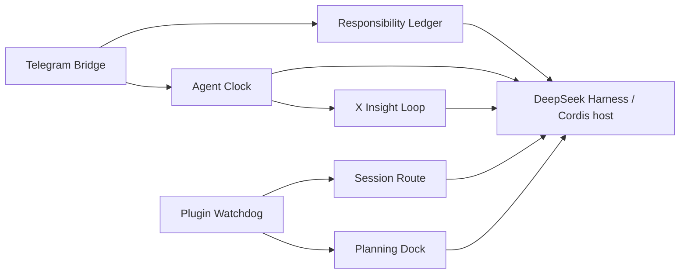

# dsh-plugins: Experimental DeepSeek Harness Plugins

[中文](README.md)

This is an experimental, personal collection of plugins the author built for their own use of **DeepSeek Harness (DSH)**. They address ordinary situations: continuing a conversation with a home Harness from Telegram while away; having an agent do something every hour and report back; tracking a long-running responsibility without losing today's work; reducing an X (Twitter) timeline to a few useful items; and keeping a long Web conversation from losing its way.

The repository evolves around the author's own needs. It makes **no promise of compatibility, long-term maintenance, timely support, or suitability for anyone else's production environment.** You are welcome to use the source as a reference and modify it for yourself; users are responsible for their own use, deployments, and consequences.

> The display names below are only for recognition and search in this README. The adjacent directory and npm package names are the real code identifiers. No API or package name has been changed.

## Overview

| Display name | Actual directory / package | When it helps | What changes after installation | Main boundary |
| --- | --- | --- | --- | --- |
| **Telegram On-the-Go / Telegram 随身入口** | [`telegram-gateway`](telegram-gateway) / `@deepseek-ai/dsh-telegram-gateway` | You are away from home and want to continue a Harness conversation with one Telegram message. | The bot feeds text into one fixed session and replies with Markdown, quotes, and reactions—without repeatedly editing streaming fragments. | Text only; needs Telegram credentials and an allowed chat ID; not a multi-bot or media gateway. |
| **Assistant Responsibility Desk / 私人助理责任台** | [`dsh-assistant`](dsh-assistant) / `@deepseek-ai/dsh-assistant` | You want an assistant to keep watching one thing without displacing what you are doing or have delegated. | It keeps focus, delegation, and monitoring separate, survives restart with the responsibility context, and reports back when a result arrives. | Not a full task list or a general workflow platform. |
| **Scheduled Agent / 定时 Agent** | [`dsh-cron`](dsh-cron) / `@deepseek-ai/dsh-cron` | You want an agent to check something hourly or prepare something daily without leaving a Web page open. | A separate session wakes on schedule, does the work, and can deliver the result to Telegram. | Starts unattended agents; you own side effects, cost, and duplicate-run boundaries. |
| **X Insight Filter / X 洞察筛选器** | [`dsh-x-feed`](dsh-x-feed) / `@deepseek-ai/dsh-x-feed` | You want a few worthwhile X/Twitter items, not an entire timeline pasted into Telegram. | It receives scheduled results and records your like/dislike/save feedback for specific X content. | Requires `dsh-cron` and Python; provides neither accounts, cookies, nor a general crawler. |
| **Conversation Route Map / 会话路线提示** | [`ui-context-compactor`](ui-context-compactor) / `@deepseek-ai/dsh-client-ui-context-compactor` | A long conversation has happened and you need Harness to retain the goal, current approach, and review triggers. | It keeps a short route note for one session so compaction or context recovery can resume the thread. | One session only; summaries can be wrong, and the host chooses model/cost. |
| **UI Plugin Watchdog / UI 插件自救器** | [`ui-plugin-guardian`](ui-plugin-guardian) / `@deepseek-ai/dsh-client-ui-plugin-guardian` | Your in-house Web UI plugin occasionally drops out and you do not want to restart it manually every time. | It notices selected plugin failures, waits out a cooldown, tries a remount, and leaves a short record. | It cannot repair bad config, dependencies, data, or external services. |
| **TODO Planning Panel / TODO 思考面板** | [`ui-progressive-todo`](ui-progressive-todo) / `@deepseek-ai/dsh-client-ui-progressive-todo` | A long task has an unclear route and you need to think before turning it into a pile of TODOs. | The Web composer gets an expandable checklist, while the prompt reminds the agent to find the authoritative TODO first. | Guidance/UI only; it neither performs work nor stores a second task list. |



The diagram shows code-level collaboration, not a requirement to install everything together. Telegram-related configuration in `dsh-assistant`, `dsh-cron`, and `dsh-x-feed` is resolved by the host credential provider; the UI packages are Web/session extensions for the host.

## Public scope and prerequisites

This repository is source reference, not a collection of published installable packages: it has no root `package.json`, unified install script, published npm tarball, or automatic activation manifest. Each directory has its own `package.json`, declares DSH/Cordis peer dependencies, and is currently versioned `0.1.0-rc.*`. Building or testing requires:

- A compatible DeepSeek Harness source checkout that can provide `@deepseek-ai/*` and Cordis dependencies. This repository does not pin a compatible Harness version.
- Node.js, pnpm, TypeScript/`tsc`, `tsdown`, and Vitest supplied by that compatible development environment.
- For Telegram plugins, `TELEGRAM_BOT_TOKEN` and `TELEGRAM_ALLOWED_CHAT_ID` in a credential provider. Never put real values in configuration, `.env`, test fixtures, or commits.
- For X Insight Loop, Python 3 plus your own lawful, policy-compliant browser/X access environment. No cookies, login state, accounts, or collected data are included here.

There is therefore no trustworthy one-line install command. First integrate an individual directory as a DSH/Cordis source plugin in an isolated environment, then wire its exported `name`, `inject`, `Config`, and `apply()` into your host composition. This repository does not claim that `dsh plugin add`, npm installation, or every DSH version will work directly.

### Minimal configuration shapes

The following are **object shapes passed to `apply()`**, not a specific DSH profile-file syntax. Credential fields are deliberately omitted for the host credential provider to resolve; angle-bracket text is a placeholder only.

```ts
// Telegram Bridge: token / allowedChatId come from the credential provider.
{ sessionId: 'session-telegram', cwd: '<workspace-directory>' }

// Responsibility Ledger: choose either the Web manager or Telegram delivery role.
{ mode: 'web' }
{ mode: 'telegram', telegramParentSessionId: 'session-telegram' }

// Agent Clock: manager registers tools; scheduler runs due jobs.
{ mode: 'manager' }
{ mode: 'scheduler', pollIntervalMs: 10_000, maxConcurrent: 3 }

// X Insight Loop: without a bound job ID, feedback tools remain but cron receipts are ignored.
{ cronJobId: '<dsh-cron-job-id>', pythonBin: '/usr/bin/python3' }

// Session Route: provider and model must be supplied together, or both omitted.
{ maxInputChars: 32_000, maxOutputTokens: 2_400 }

// Plugin Watchdog / Planning Dock
{ watched: ['ui-progressive-todo'], repairCooldownMs: 30_000 }
{}
```

Telegram Bridge, Responsibility Ledger, and Agent Clock ask the credential provider for Telegram credentials; do not put a token or chat ID directly into a source-controlled object. X Insight Loop defaults its data under the host's `DSH_HOME`; Session Route uses an explicit reducer only when `provider` and `model` are set together.

## Plugin behavior and limits

### Telegram On-the-Go / Telegram 随身入口

When you are away, you may want to continue a conversation with your home Harness by sending one Telegram message, instead of opening a remote browser. With `telegram-gateway`, the bot feeds text into one fixed session and returns complete replies to Telegram; Markdown, quotes, and reactions work, but you do not get a half-sentence repeatedly edited while the model streams.

- Validates bot credentials and accepts messages only from the configured chat ID.
- Keeps one stable session so the next message continues the existing context.
- Sends Telegram Rich Markdown, reply quotes, reactions, complete interim messages, and chunked final messages.
- Never shows `assistant/chunk` token fragments and never edits a message after it has been sent.
- Does not handle media, files, commands, multiple bots, or multi-tenancy; deployers still need to test network and duplicate-delivery behavior.

### Assistant Responsibility Desk / 私人助理责任台

You might ask an assistant to keep watching a long-running update while you work on something else or delegate another task. Those responsibilities should not knock each other out. With `dsh-assistant`, a restart still leaves the assistant able to tell who owns each responsibility, whether it was paused, where it got to, and where to report when there is a result.

- Tracks one user focus (`focus`) alongside multiple `delegated` tasks and `monitor` responsibilities.
- Binds a continuable child agent to each responsibility, including pause and resume of that same responsibility.
- Records progress and reminders and uses one terminal outbox to avoid duplicate delivery.
- Telegram mode schedules and delivers; Web mode only observes the responsibilities it knows about.
- It is not your complete task list, an approval flow, a general queue, or an exactly-once guarantee for external writes.

### Scheduled Agent / 定时 Agent

If you want an agent to check information every hour or prepare something every day, you should not have to leave a Web page open waiting for it. With `dsh-cron`, a separate session wakes on schedule, does the work, and can send the result back to Telegram.

- The `manager` role supplies agent tools to create, list, and delete scheduled jobs.
- The `scheduler` role reads the job log and runs due work in separate `session-cron-<jobId>` sessions.
- Supports polling interval, concurrency cap, error delivery, and storage-directory settings.
- Can deliver terminal results through Telegram.
- Every job can start models, tools, and external side effects; it is not a free reminder service or an exactly-once executor.

### X Insight Filter / X 洞察筛选器

Pulling a few worthwhile items from an X/Twitter timeline is often more useful than dumping the whole feed into Telegram. With `dsh-x-feed`, the scheduled result can reach an insight pipeline, while your like, dislike, and save feedback on specific X content becomes local input for later use.

- Listens for a bound `dsh-cron/run-finished` terminal event and invokes the Python insight pipeline.
- Adds feedback tools to a chosen Telegram root for X URLs, likes/dislikes, and saving/unsaving.
- Stores local feedback and saved items; without a `cronJobId`, feedback remains available but cron receipts are ignored.
- Lets a deployer configure Python, data directory, and the target Telegram session.
- Requires `dsh-cron` and Python, manages no X account, includes no cookie/login state, and does not promise collection availability.

### Conversation Route Map / 会话路线提示

After a long conversation, the annoying failure is that Harness loses the goal, the current approach, and the condition that should make it reconsider. With `ui-context-compactor`, one root session keeps a short route note that can reconnect the thread after compaction or context recovery.

- Collects goals, current route, decisions, evidence pointers, and review conditions.
- Calls an auxiliary reducer within explicit size limits and keeps the last valid route on failure.
- Detects secret-like material to avoid spreading obviously sensitive text into route state.
- Can use an explicit reducer `provider` and `model` as a pair, or the host's default selection.
- Handles one session only; summaries can still be wrong and do not replace the original log or a cross-session knowledge base.

### UI Plugin Watchdog / UI 插件自救器

When an in-house Web UI plugin occasionally drops out, manually restarting it every time gets tiresome. With `ui-plugin-guardian`, selected plugins are watched; a failed or disposed one is remounted after a cooldown and leaves a small record for diagnosis.

- Watches `ui-progressive-todo` and `ui-context-compactor` by default.
- Can instead watch only the plugin names listed in configuration.
- Uses a separate cooldown per plugin to avoid a rapid remount loop.
- Records detection, remount start, success, and failure in a short audit trail.
- Cannot repair bad configuration, incompatible dependencies, corrupted data, or external services; automatic remounting can amplify a fault, so isolate it first.

### TODO Planning Panel / TODO 思考面板

For a long task with an unclear route, immediately piling up TODO items usually makes it less clear. With `ui-progressive-todo`, the Web composer gets an expandable checklist and the system prompt reminds the agent to find the authoritative TODO before taking the next small step.

- Adds pre-task thinking and progressive TODO guidance to the system prompt.
- Supplies an expandable Web-composer checklist and localized text.
- Treats a project `TODO.md` or host-designated source as authoritative state.
- Creates no second task database and does not perform the work written in a TODO.
- Is not meant to ritualize a simple, low-risk, one-off operation.

## Build, test, and local development

There is no unified install/build/test command, and the `@deepseek-ai/*` dependencies are not published as directly retrievable npm dependencies. Do not run `pnpm install` or `pnpm run bundle` in an isolated clone: the package manager will try, and fail, to fetch those source/private dependencies from npm. The commands below use a compatible Harness source checkout as the toolchain and dependency source. They are not a release process and do not deploy services.

```bash
# Point at your own prepared, compatible Harness source checkout.
export DSH_HARNESS_ROOT='<path-to-deepseek-harness>'

# Every public package has tsdown.config.ts; run this for the package you build.
(cd telegram-gateway && "$DSH_HARNESS_ROOT/node_modules/.bin/tsdown" --config tsdown.config.ts)
(cd dsh-assistant && "$DSH_HARNESS_ROOT/node_modules/.bin/tsdown" --config tsdown.config.ts)
(cd dsh-cron && "$DSH_HARNESS_ROOT/node_modules/.bin/tsdown" --config tsdown.config.ts)
(cd dsh-x-feed && "$DSH_HARNESS_ROOT/node_modules/.bin/tsdown" --config tsdown.config.ts)
(cd ui-context-compactor && "$DSH_HARNESS_ROOT/node_modules/.bin/tsdown" --config tsdown.config.ts)
(cd ui-plugin-guardian && "$DSH_HARNESS_ROOT/node_modules/.bin/tsdown" --config tsdown.config.ts)
(cd ui-progressive-todo && "$DSH_HARNESS_ROOT/node_modules/.bin/tsdown" --config tsdown.config.ts)
```

Tests also run per package:

```bash
# Point this at your own compatible Harness source checkout.
export DSH_HARNESS_ROOT='<path-to-deepseek-harness>'

(cd dsh-assistant && node "$DSH_HARNESS_ROOT/node_modules/vitest/vitest.mjs" run)
(cd dsh-cron && node "$DSH_HARNESS_ROOT/node_modules/vitest/vitest.mjs" run)
(cd dsh-x-feed && node "$DSH_HARNESS_ROOT/node_modules/vitest/vitest.mjs" run)
(cd telegram-gateway && node "$DSH_HARNESS_ROOT/node_modules/vitest/vitest.mjs" run)
(cd ui-context-compactor && node "$DSH_HARNESS_ROOT/node_modules/vitest/vitest.mjs" run)
(cd ui-plugin-guardian && node "$DSH_HARNESS_ROOT/node_modules/vitest/vitest.mjs" run)

# The UI client test also needs a compatible React package directory; no author-machine path is hard-coded.
export DSH_HARNESS_REACT='<path-to-compatible-react-package>'
(cd ui-progressive-todo && DSH_HARNESS_REACT="$DSH_HARNESS_REACT" node "$DSH_HARNESS_ROOT/node_modules/vitest/vitest.mjs" run)
```

Each package's `tsconfig.json` and `tsdown.config.ts` can also be used for explicit checks:

```bash
(cd telegram-gateway && "$DSH_HARNESS_ROOT/node_modules/.bin/tsc" -b tsconfig.json)
# Replace the directory name for another package. Do not recommit machine-specific dependency paths into manifests or lockfiles.
```

For local development, change one plugin, build/test its own directory, then load its exported module through your own DSH composition. Do not commit `lib/`, `node_modules/`, SQLite/session data, cookies, `.env`, private keys, or real runtime logs; they are not public source.

## Security and deployment boundary

- `.gitignore` excludes common credentials, `.env`, key files, SQLite/WAL/SHM files, runtime logs, build outputs, and local session state. Ignore rules are not access control: review every change before committing.
- Telegram credentials belong only in the host credential provider. Examples never contain a real token, chat ID, host, account, cookie, or personal profile.
- X Insight Loop's interaction with external content and a browser environment is the deployer's responsibility; comply with service terms, applicable law, and account-security requirements.
- This public repository excludes the author's deployment scripts, remote-host material, runtime databases, acceptance records, research notes, and personal long-term memory. It offers no production deployment promise.
- Scheduling, automatic remounting, child agents, and external message delivery all carry irreversible or duplicate risks. Verify in isolation before using real accounts or data.

## Layout

```text
telegram-gateway/       Telegram bot/gateway source and tests
dsh-assistant/          Personal-assistant responsibilities, reminders, outbox, migration tool
dsh-cron/               Scheduled agent manager/scheduler
dsh-x-feed/             X insight TypeScript integration and Python pipeline
ui-context-compactor/   Single-session route and context projection
ui-plugin-guardian/     Cordis plugin-fiber observation and remounting
ui-progressive-todo/    Web TODO planning guidance and composer UI
tsdown.client.ts        Shared Web-client bundling configuration
web/                    Small Web platform type entry point
```

## License

This repository currently provides **no open-source license**. Public visibility on GitHub does not grant permission to use, copy, modify, or distribute the code; do not assume those rights until the author explicitly supplies a license. The `package.json` files are not separate license text.
