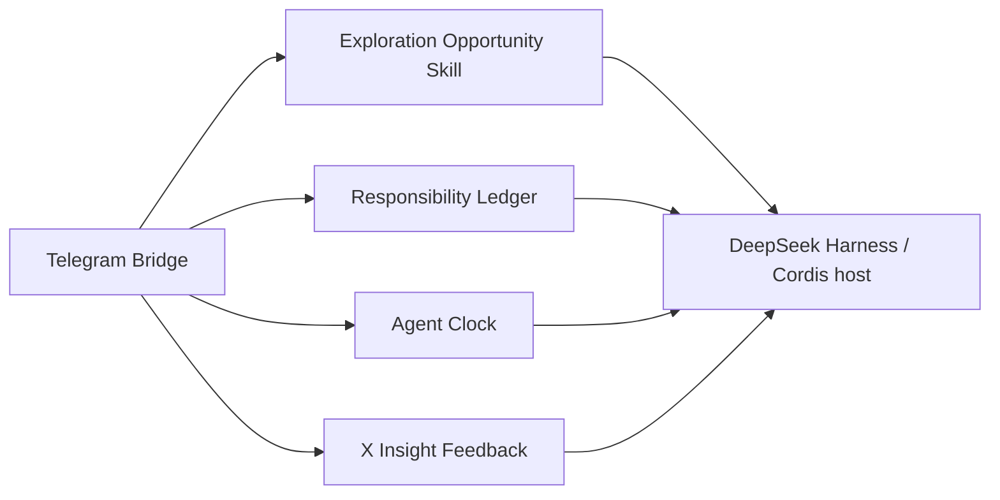

# dsh-plugins：DeepSeek Harness 实验插件与 Skill

[English](README.en.md)

这是作者为自己使用 **DeepSeek Harness（DSH）** 编写的实验性、自用插件与 Skill 集合。它解决的是很具体的日常场景：人在外面时想用 Telegram 继续指挥家里的 Harness；看到一条链接时，想让它先查证并告诉你一个值得继续听下去的点；想把真正感兴趣的题目留到以后探索；想让 Agent 定时做事、结束后回来告诉你；想同时盯一个长期任务又不丢掉手上正在做的事；或想把 X（Twitter）时间线筛成少量值得看的内容。

项目按作者自己的实际需要演进：**不承诺兼容性、长期维护、及时答疑，也不承诺适合他人的生产环境。** 欢迎阅读和参考；在作者明确发布许可证前，如需复制、修改或分发，请先取得作者授权。使用、部署及其后果由使用者自行承担。

> 这里的“展示名”仅用于本 README 的识别和检索；紧邻的目录名以及组件类型才是代码中的真实标识。它们没有修改 API、包名或 Skill 名。

## 发版入口

这个仓库部署到 `herman.hermes` 时，唯一入口是：

```bash
./release/dsh
```

开发、上线前测试和生产运行使用同一个不可变 Docker/OCI 镜像；镜像只能从明确的 Harness commit 和插件 commit 构建。禁止直接同步源码、修改线上 selector、在线安装依赖，也禁止恢复或扩展已退役的源码发版系统。停机、快照、上线、真实验收、正式接受和回退的完整边界见 [`release/README.md`](release/README.md)。

## 仓库总览

| 展示名 | 实际目录 / 类型 | 什么时候会需要 | 装上后会怎样 | 主要边界 |
| --- | --- | --- | --- | --- |
| **Telegram 随身入口 / Telegram On-the-Go** | [`telegram-gateway`](telegram-gateway) / `@deepseek-ai/dsh-telegram-gateway` | 出门后还想用 Telegram 发一句话继续和家里的 Harness 对话。 | Bot 把话送进固定会话，用 Telegram MarkdownV2 转换后的普通消息回复，保留局部引用和 reaction；不会把流式半句话反复改来改去。 | 仅文本；需要 Telegram 凭据和允许的 chat ID；不是多 bot 或媒体网关。 |
| **私人助理责任台 / Assistant Responsibility Desk** | [`dsh-assistant`](dsh-assistant) / `@deepseek-ai/dsh-assistant` | 想让助手长期盯一件事，同时又不丢掉自己正在做或刚委派的事。 | 它能分别记住焦点、委派和监控；重启后仍知道该向谁回报，并在有结果时送回来。 | 不是完整待办清单或通用工作流平台。 |
| **定时 Agent / Scheduled Agent** | [`dsh-cron`](dsh-cron) / `@deepseek-ai/dsh-cron` | 想让 Agent 每小时看一次信息、每天做一次整理，而不必一直开网页等着。 | 到点会唤醒独立会话完成工作，并可把结果送到 Telegram。 | 会启动无人值守 Agent；副作用、成本和重复执行边界要自行承担。 |
| **X 洞察筛选器 / X Insight Filter** | [`x-feed`](x-feed) 私有业务运行时 + [`skills/x-feed`](skills/x-feed) Skill | 想从 X/Twitter 时间线挑几条值得看，而不是整条信息流搬进 Telegram。 | 本版本保留 selector，以及 x-feed 的 Telegram 反馈/收藏扩展；旧 V1 的 `dsh-cron` 自动 Feed 接线已退休，仓库仍保留未正式接线的 legacy direct/Python 路线。 | 它不是插件；依赖宿主的通用扩展口和 Python，不提供账号、cookie 或通用爬虫。 |
| **探索机会 / Exploration Opportunity** | [`skills/explore-opportunity`](skills/explore-opportunity) / Skill | 你丢来一句话或链接，想先听懂背后最有意思的机制；真的感兴趣时再留到以后。 | Agent 用宿主已有的搜索、网页、文件或 Shell 能力做初步查证，先给一个“还想再听一点”的钩子；只有你明确表态才更新 `EXPLORE.md`。 | 不自带浏览器、网络隔离或后台任务；普通追问次数不会自动入池。 |



图只表示代码中存在的协作关系，不表示必须一次安装全部组件。探索机会由宿主的 Skill 机制按语义发现，再协调这个 Agent 原本就有的搜索、网页、文件或 Shell 工具；它不依赖另一个探索插件，也不让其他插件因为发现它存在就偷偷改变行为。`x-feed` 不是 Cordis 插件：本版本由 `telegram-gateway` 通过通用 Telegram 扩展口加载反馈和收藏；旧 V1 的 `dsh-cron` 自动 Feed 接线已退休。

## 公开范围与前置条件

这个仓库是源码参考，不是已发布的安装包或 Skill 集合：没有根 `package.json`、统一安装脚本、发布的 npm tarball 或自动激活清单。插件目录自己的 `package.json` 都声明了 DSH/Cordis peer dependencies，且目前的版本是 `0.1.0-rc.*`；`x-feed` 是不发布的私有业务包。要构建或测试，需要：

- 一个与这些源码相容的 DeepSeek Harness 源码检出，其中能提供 `@deepseek-ai/*` 与 Cordis 依赖；兼容版本没有在本仓库冻结。
- Node.js、pnpm、TypeScript/`tsc`、`tsdown`、Vitest；它们应由该兼容开发环境提供。
- 使用 Telegram 相关插件时，一个凭据提供方中的 `TELEGRAM_BOT_TOKEN` 和 `TELEGRAM_ALLOWED_CHAT_ID`。不要把真实值写进配置、`.env`、测试夹具或提交。
- 使用 X Insight Loop 时，Python 3 和你自己依法、合规配置的浏览器/X 访问环境；本仓库不附带 cookie、登录态、账号或抓取结果。
- 使用 Exploration Opportunity 时，宿主必须支持发现和加载 Skill，并允许 Agent 在当前工作区维护 `EXPLORE.md`；Skill 本身不会增加新的网页或浏览器工具。

因此没有可靠的“一行安装命令”。Cordis 插件请先在隔离环境中接入；Skill 放入宿主可发现的目录。`x-feed` 要构建后由 `telegram-gateway.extensions` 加载，不能再按插件安装。旧 V1 的 `dsh-cron.environmentModules` 接线已从正式 Telegram profile 删除；仓库保留的 legacy direct/Python 路线未正式接线。这里没有声称 `dsh plugin add`、npm 安装或任意 DSH 版本可以直接工作。

### 最小配置形状

以下是传给各插件 `apply()` 的**字段形状示例**，不是某个特定 DSH profile 文件格式。凭据字段故意省略，让宿主的 credential provider 解析；尖括号内容只是占位符。

```ts
// Telegram Bridge: token / allowedChatId 由 credential provider 提供。
{ sessionId: 'session-telegram', cwd: '<workspace-directory>' }

// Responsibility Ledger: Web 管理端或 Telegram 调度/投递端二选一。
{ mode: 'web' }
{ mode: 'telegram', telegramParentSessionId: 'session-telegram' }

// Agent Clock: manager 注册工具；scheduler 执行到期 job。
{ mode: 'manager' }
{
  mode: 'scheduler',
  pollIntervalMs: 10_000,
  maxConcurrent: 3,
  // 本版本正式 Telegram profile 不再接入 x-feed environment module。
}

// Telegram Bridge 可加载同一业务包的反馈适配器；x-feed 本身没有 apply()。
{ extensions: [{ modulePath: '<x-feed>/lib/index.js', configJson: '{}' }] }

```

`Telegram Bridge`、`Responsibility Ledger` 和 `Agent Clock` 都会从 credential provider 查找 Telegram 凭据；不要把 token 或 chat ID 直接填到源码控制中的对象里。`Exploration Opportunity` 和 `X Feed` Skill 都没有 `apply()`；后者只指导现有 X 工具的使用。`x-feed` 的默认数据目录仍是宿主 `DSH_HOME/storages/dsh-x-feed`，因此重构不迁移或删除旧数据。

## 各组件的功能与限制

### Telegram 随身入口 / Telegram On-the-Go

你在外面时，只想用 Telegram 发一句话继续和家里的 Harness 对话，而不是远程开浏览器。装上 `telegram-gateway` 后，bot 会把文本交给一个固定会话，并用普通 `sendMessage` 把 Telegram MarkdownV2 转换后的完整回复送回 Telegram；局部引用和 reaction 会保留，也不会出现流式半句话被反复编辑的体验。

- 验证 bot 凭据并只接受指定 chat ID 的消息。
- 保留固定会话，让后续消息接上已有上下文。
- 日常正文走普通 `sendMessage` + Telegram MarkdownV2，保留局部引用、reaction、完整中途消息和分块终稿。
- 不展示 `assistant/chunk` 的 token 半成品，也不编辑已经发送的正文。
- 只有 Telegram 明确返回不可重试的格式拒绝时，才带同一引用参数回退一次纯文本；429/5xx、超时和其他不确定结果都不补发。
- 不处理媒体、文件、命令、多 bot 或多租户；网络失败和重复投递仍要由部署者验收。

### 私人助理责任台 / Assistant Responsibility Desk

你可以让助手长期盯着一个更新，同时给自己正在做的事计时，或委派另一件工作；这些事不该互相顶掉。装上 `dsh-assistant` 后，服务重启后它仍能分清每件事是谁负责、是否暂停、做到哪里，并在结果出来时通过 Telegram 回来告诉你。

- 同时记录一个用户焦点 `focus`、多项 `delegated` 委派和 `monitor` 监控。
- 将可继续的子 Agent 与各自责任绑定，暂停/恢复时继续同一责任。
- 提醒到期、记录进度，并通过最终 outbox 避免重复交付。
- Telegram 模式负责调度和投递；Web 模式只观察其已知责任。
- 它不是你的完整待办清单、审批流、通用队列或外部写操作的 exactly-once 保证。

### 定时 Agent / Scheduled Agent

想让 Agent 每小时看一次信息、每天整理一次内容时，不必一直开网页等着。装上 `dsh-cron` 后，到点会唤醒独立会话做工作，完成后可把结果送回 Telegram。

- `manager` 角色提供创建、列出、删除定时任务的 Agent 工具。
- `scheduler` 角色读取 job log，在到期时运行独立 `session-cron-<jobId>` 会话。
- 可设置轮询间隔、并发上限、错误投递与存储目录。
- 终态结果可经 Telegram 投递。
- 通用 `prepared-delivery/v1` 能让业务先冻结最终正文、交付后再提交状态；复杂业务可通过受信任务环境模块接入，同样获得持久回执与崩溃后补确认。
- 每个 job 都可能启动模型、工具和外部副作用；不应当作无成本提醒器或 exactly-once 执行器。

### X 洞察筛选器 / X Insight Filter

每小时从 X/Twitter 时间线里挑几条真正值得看的内容，比把整条信息流搬进 Telegram 更有用。这里不再提供 `dsh-x-feed` 插件：[`x-feed`](x-feed) 是业务运行时，[`skills/x-feed`](skills/x-feed) 是 Agent 行为说明。旧 V1 的正式 `dsh-cron` 自动 Feed 已退休；selector 和 x-feed Telegram 反馈/收藏仍保留，仓库中的 legacy direct/Python 路线明确保留但未正式接线。本版本不把 V2 写成已上线。

公开范围只包括 Python 收集/投递准备管线、`dsh-cron` receipt 接口和本地 feedback/store；**不包含作者个人的排序或选稿 prompt**。使用者需要按自己的目标、来源和边界编写 cron prompt。

- `telegram-gateway` 的通用扩展口把 X URL、喜欢/不喜欢、收藏/取消收藏能力限制在指定 Telegram root。
- `skills/x-feed` 只负责何时使用这些能力，不保存第二份状态，也不模拟定时器或交付事务。
- 本地反馈、收藏和 shown 数据沿用原目录；重构不删除或自动迁移用户数据。
- 依赖 `dsh-cron` 和 Python，不管理 X 账号、不提供 cookie/登录态，也不承诺抓取可用性。

### 探索机会 Skill / Exploration Opportunity

看到一个新概念时，你可能只想先听一句“它真正厉害在哪”，而不是立刻决定要不要建待办。把 [`skills/explore-opportunity`](skills/explore-opportunity) 放进宿主可发现的 Skill 目录后，Agent 会先用已有工具做初步查证，并自然地讲出一个具体发现；它不会先问“要不要入池”。

- Skill 只负责一套可复用的行为合同，不注册自定义工具、服务、数据库或后台 worker。
- 它协调宿主已经提供的搜索、网页、文件或 Shell 能力；页面读不到、图片没进入上下文或只有搜索摘要时，必须如实保留证据边界。
- 只有用户当前消息明确表达感兴趣或不感兴趣时，才更新工作区唯一的 `EXPLORE.md`；普通追问次数本身不算持久信号。
- 活跃候选保留来源、为什么值得继续、当前认识、下一问和深度报告入口；排除项保留用户自己的简短理由。
- 用户要从候选里挑一个时最多问三个二选一问题；只有用户明确要求时才做深度调查并写入 `research/`。
- 它不是任务、长期 MEMORY、X 收藏夹或定时系统，也不额外提供图片入口、浏览器控制、网络隔离或后台研究。

## 构建、测试与本地开发

当前没有统一的 install/build/test 命令，而且 `@deepseek-ai/*` 依赖没有作为可直接获取的 npm 依赖发布。不要在独立克隆中直接运行 `pnpm install` 或 `pnpm run bundle`：包管理器会尝试从 npm 补齐这些私有/源码依赖而失败。下面是以兼容 Harness 源码检出作为工具链和依赖来源的命令；它们不是发布流程，也不会部署服务。

```bash
# 先指向你自己、已准备好的兼容 Harness 源码检出。
export DSH_HARNESS_ROOT='<path-to-deepseek-harness>'

# 所有公开包都有 tsdown.config.ts；对要构建的目录逐个执行。
(cd telegram-gateway && "$DSH_HARNESS_ROOT/node_modules/.bin/tsdown" --config tsdown.config.ts)
(cd dsh-assistant && "$DSH_HARNESS_ROOT/node_modules/.bin/tsdown" --config tsdown.config.ts)
(cd dsh-cron && "$DSH_HARNESS_ROOT/node_modules/.bin/tsdown" --config tsdown.config.ts)
(cd x-feed && "$DSH_HARNESS_ROOT/node_modules/.bin/tsdown" --config tsdown.config.ts)
```

测试同样逐包执行：

```bash
# 需要将该变量指向你自己的兼容 Harness 源码检出。
export DSH_HARNESS_ROOT='<path-to-deepseek-harness>'

(cd dsh-assistant && node "$DSH_HARNESS_ROOT/node_modules/vitest/vitest.mjs" run)
(cd dsh-cron && node "$DSH_HARNESS_ROOT/node_modules/vitest/vitest.mjs" run)
(cd x-feed && node "$DSH_HARNESS_ROOT/node_modules/vitest/vitest.mjs" run)
(cd telegram-gateway && node "$DSH_HARNESS_ROOT/node_modules/vitest/vitest.mjs" run)

# Skill 没有构建产物；可用兼容的 Skill Creator 校验目录结构和 frontmatter。
python '<path-to-skill-creator>/scripts/quick_validate.py' skills/explore-opportunity
python '<path-to-skill-creator>/scripts/quick_validate.py' skills/x-feed
```

每个包的 `tsconfig.json` 和 `tsdown.config.ts` 也可用于显式检查：

```bash
(cd telegram-gateway && "$DSH_HARNESS_ROOT/node_modules/.bin/tsc" -b tsconfig.json)
# 对其他目录替换目录名即可；请勿把本机依赖的绝对路径重新提交到 manifest 或锁文件。
```

本地开发时，可改动一个插件并在相应目录构建/测试，或修改一个 Skill 后重新运行 Skill 校验，再由你自己的 DSH 宿主加载。不要把 `lib/`、`node_modules/`、SQLite/session 数据、cookie、`.env`、私钥或真实运行日志提交回来；它们都不是公开源码的一部分。

## 安全与部署边界

- `.gitignore` 排除常见凭据、`.env`、密钥文件、SQLite/WAL/SHM、运行日志、构建物和本地 session 状态。忽略规则不是权限控制：提交前仍应人工审查差异。
- Telegram 凭据只应交给宿主的 credential provider。示例从不包含真实 token、chat ID、主机、账号、cookie 或个人档案。
- `x-feed` 对外部内容与浏览器环境的行为由部署者负责；遵守服务条款、适用法律及账号安全要求。
- `explore-opportunity` 只是对现有工具的行为指导，不是安全沙箱；网页和外部文件仍应视为不可信数据，实际可访问范围与副作用由宿主提供的工具决定。
- 探索状态只放在工作区 `EXPLORE.md`；它不等于任务系统、长期 MEMORY、X 收藏夹或 cron，也不会自行启动深度调查。
- 本公开仓库不包含作者的部署脚本、远端主机资料、运行数据库、验收记录、研究笔记或个人长期认识；也不提供任何生产部署承诺。
- 自动调度、自动重挂、子 Agent 和外部消息投递都有不可逆或重复风险。先在隔离环境验证，再决定是否用于真实账号或数据。

## 目录结构

```text
telegram-gateway/       Telegram bot/gateway 插件源码与测试
dsh-assistant/          个人助理责任、提醒与 outbox
dsh-cron/               定时 Agent manager/scheduler
x-feed/                 X 洞察私有业务运行时与 Python 流水线（非插件）
skills/x-feed/          X 反馈与收藏的 Agent 行为说明
skills/explore-opportunity/  用现有工具查证线索并维护显式兴趣的 Skill
```

## 许可证

仓库目前**没有提供开源许可证**。GitHub 上公开可见不等于授予使用、复制、修改或分发权；在作者明确提供许可证前，请不要假设这些权利已被授予。各 `package.json` 也不应被理解为单独的许可文本。
