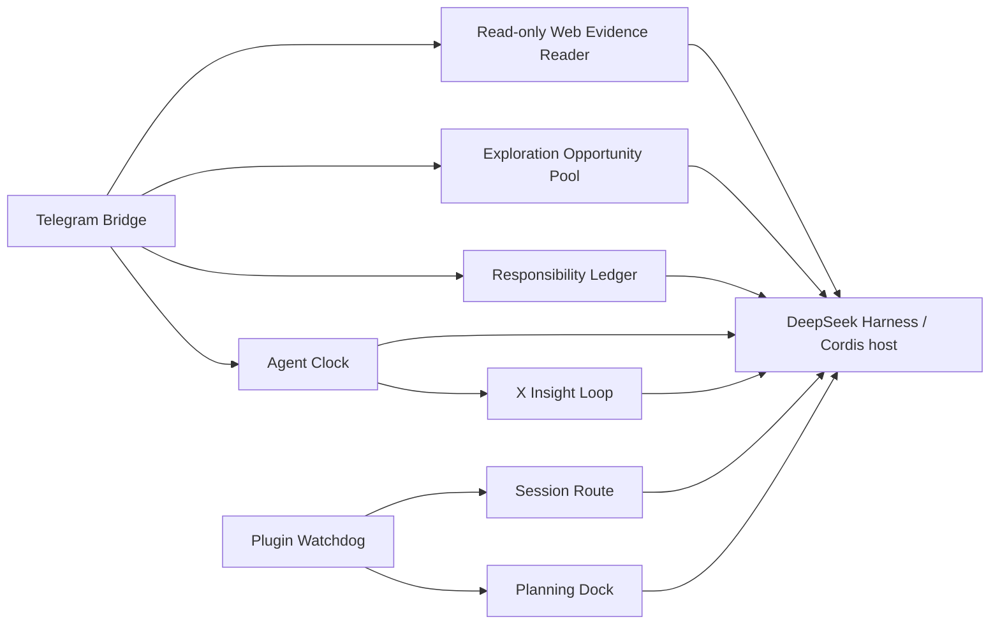

# dsh-plugins：DeepSeek Harness 实验插件集

[English](README.en.md)

这是作者为自己使用 **DeepSeek Harness（DSH）** 编写的实验性、自用插件集合。它解决的是很具体的日常场景：人在外面时想用 Telegram 继续指挥家里的 Harness；看到一条链接时，想让它先查证并告诉你一个值得继续听下去的点；想把真正感兴趣的题目留到以后探索；想让 Agent 定时做事、结束后回来告诉你；想同时盯一个长期任务又不丢掉手上正在做的事；想把 X（Twitter）时间线筛成少量值得看的内容；或想让长对话和 Web 界面不那么容易迷路。

项目按作者自己的实际需要演进：**不承诺兼容性、长期维护、及时答疑，也不承诺适合他人的生产环境。** 欢迎阅读和参考；在作者明确发布许可证前，如需复制、修改或分发，请先取得作者授权。使用、部署及其后果由使用者自行承担。

> 这里的“展示名”仅用于本 README 的识别和检索；紧邻的目录名与 npm package 名才是代码中的真实标识。它们没有修改 API 或包名。

## 仓库总览

| 展示名 | 实际目录 / package | 什么时候会需要 | 装上后会怎样 | 主要边界 |
| --- | --- | --- | --- | --- |
| **Telegram 随身入口 / Telegram On-the-Go** | [`telegram-gateway`](telegram-gateway) / `@deepseek-ai/dsh-telegram-gateway` | 出门后还想用 Telegram 发一句话继续和家里的 Harness 对话。 | Bot 把话送进固定会话，用 Telegram MarkdownV2 转换后的普通消息回复，保留局部引用和 reaction；不会把流式半句话反复改来改去。 | 仅文本；需要 Telegram 凭据和允许的 chat ID；不是多 bot 或媒体网关。 |
| **私人助理责任台 / Assistant Responsibility Desk** | [`dsh-assistant`](dsh-assistant) / `@deepseek-ai/dsh-assistant` | 想让助手长期盯一件事，同时又不丢掉自己正在做或刚委派的事。 | 它能分别记住焦点、委派和监控；重启后仍知道该向谁回报，并在有结果时送回来。 | 不是完整待办清单或通用工作流平台。 |
| **定时 Agent / Scheduled Agent** | [`dsh-cron`](dsh-cron) / `@deepseek-ai/dsh-cron` | 想让 Agent 每小时看一次信息、每天做一次整理，而不必一直开网页等着。 | 到点会唤醒独立会话完成工作，并可把结果送到 Telegram。 | 会启动无人值守 Agent；副作用、成本和重复执行边界要自行承担。 |
| **X 洞察筛选器 / X Insight Filter** | [`dsh-x-feed`](dsh-x-feed) / `@deepseek-ai/dsh-x-feed` | 想从 X/Twitter 时间线挑几条值得看，而不是整条信息流搬进 Telegram。 | 它接收定时任务的结果，并记住你对具体 X 内容的喜欢、不喜欢和收藏反馈。 | 依赖 `dsh-cron` 与 Python；不提供账号、cookie 或通用爬虫。 |
| **只读网页查证器 / Read-only Web Evidence Reader** | [`dsh-browser-readonly`](dsh-browser-readonly) / `@deepseek-ai/dsh-browser-readonly` | 你在 Telegram 发来一篇文章或公开 X 帖子，想先知道它究竟说了什么、有没有值得深挖的机制。 | Agent 能读取受限的公开页面内容，或只抽取一条精确的公开 X status，给出有证据边界的回答。 | 不是通用浏览器：普通网页只做静态 GET，X 只允许精确 status；不点击、不输入、不下载，也不截图。 |
| **探索机会池 / Exploration Opportunity Pool** | [`dsh-explore`](dsh-explore) / `@deepseek-ai/dsh-explore` | 你对一个新概念表示“这个有意思”，但当下不想立刻投入两小时研究。 | 它把有具体发现和下一问的候选留下来；你以后问起时能接着选，不感兴趣的也不会反复推回来。 | 不是任务、长期 MEMORY 或定时系统；不会因普通追问自动入池，也不会自行做深度研究。 |
| **会话路线提示 / Conversation Route Map** | [`ui-context-compactor`](ui-context-compactor) / `@deepseek-ai/dsh-client-ui-context-compactor` | 长对话过后，想让 Harness 还知道目标、当前做法和该复查什么。 | 它为一个会话整理简短路线摘要，压缩后也能重新接上上下文。 | 只服务单个 session；摘要仍可能错，模型和费用由宿主决定。 |
| **UI 插件自救器 / UI Plugin Watchdog** | [`ui-plugin-guardian`](ui-plugin-guardian) / `@deepseek-ai/dsh-client-ui-plugin-guardian` | Web 上的自家 UI 插件偶发掉线时，不想每次都手动重启。 | 它发现指定插件失败后会按冷却时间尝试重新挂载，并留下简短记录。 | 不能修好坏配置、坏依赖、坏数据或外部服务。 |
| **TODO 思考面板 / TODO Planning Panel** | [`ui-progressive-todo`](ui-progressive-todo) / `@deepseek-ai/dsh-client-ui-progressive-todo` | 面对路线不清的长期任务，想先把问题想明白，而不是立刻堆 TODO。 | Web 输入框旁会出现检查清单，系统提示也会提醒先找权威 TODO 再行动。 | 只提供提示和界面，不替你执行任务或保存第二份待办。 |



图只表示代码中存在的协作关系，不表示必须一次安装全部组件。探索机会池由 Telegram root 中的模型按语义调用；它可让只读网页查证器提供证据，但两包也可独立使用。`dsh-assistant`、`dsh-cron`、`dsh-x-feed` 的 Telegram 相关配置由宿主的凭据提供方解析；UI 插件是宿主 Web/会话扩展。

## 公开范围与前置条件

这个仓库是源码参考，不是已发布的安装包集合：没有根 `package.json`、统一安装脚本、发布的 npm tarball 或自动激活清单。各目录自己的 `package.json` 都声明了 DSH/Cordis peer dependencies，且目前的版本是 `0.1.0-rc.*`。要构建或测试，需要：

- 一个与这些源码相容的 DeepSeek Harness 源码检出，其中能提供 `@deepseek-ai/*` 与 Cordis 依赖；兼容版本没有在本仓库冻结。
- Node.js、pnpm、TypeScript/`tsc`、`tsdown`、Vitest；它们应由该兼容开发环境提供。
- 使用 Telegram 相关插件时，一个凭据提供方中的 `TELEGRAM_BOT_TOKEN` 和 `TELEGRAM_ALLOWED_CHAT_ID`。不要把真实值写进配置、`.env`、测试夹具或提交。
- 使用 X Insight Loop 时，Python 3 和你自己依法、合规配置的浏览器/X 访问环境；本仓库不附带 cookie、登录态、账号或抓取结果。

因此没有可靠的“一行安装命令”。请先在隔离环境中把每个目录作为 DSH/Cordis source plugin 接入，再按其导出的 `name`、`inject`、`Config` 和 `apply()` 连接到宿主 composition。没有声称 `dsh plugin add`、npm 安装或任意 DSH 版本可以直接工作。

### 最小配置形状

以下是传给各插件 `apply()` 的**字段形状示例**，不是某个特定 DSH profile 文件格式。凭据字段故意省略，让宿主的 credential provider 解析；尖括号内容只是占位符。

```ts
// Telegram Bridge: token / allowedChatId 由 credential provider 提供。
{ sessionId: 'session-telegram', cwd: '<workspace-directory>' }

// Responsibility Ledger: Web 管理端或 Telegram 调度/投递端二选一。
{ mode: 'web' }
{ mode: 'telegram', telegramParentSessionId: 'session-telegram' }

// Agent Clock: manager 注册工具；scheduler 执行到期 job。
{ mode: 'manager' }
{ mode: 'scheduler', pollIntervalMs: 10_000, maxConcurrent: 3 }

// X Insight Loop: 没有绑定 job ID 时只保留反馈工具，不处理 cron 回执。
{ cronJobId: '<dsh-cron-job-id>', pythonBin: '/usr/bin/python3' }

// Read-only Web Evidence Reader: 只挂到指定 Telegram root；CDP 仅接受 loopback HTTP。
{ telegramSessionId: 'session-telegram', cdpBaseUrl: 'http://127.0.0.1:9222' }

// Exploration Opportunity Pool: 候选账本独立于任务、MEMORY 与 cron。
{ telegramSessionId: 'session-telegram', dataDir: '<host-managed-data-directory>' }

// Session Route: provider 与 model 要同时提供，或同时省略。
{ maxInputChars: 32_000, maxOutputTokens: 2_400 }

// Plugin Watchdog / Planning Dock
{ watched: ['ui-progressive-todo'], repairCooldownMs: 30_000 }
{}
```

`Telegram Bridge`、`Responsibility Ledger` 和 `Agent Clock` 都会从 credential provider 查找 Telegram 凭据；不要把 token 或 chat ID 直接填到源码控制中的对象里。`Read-only Web Evidence Reader` 和 `Exploration Opportunity Pool` 只在匹配的 Telegram root 提供能力；后者的 `dataDir` 是独立账本，不是任务、MEMORY 或 cron 数据目录。`X Insight Loop` 的默认数据目录位于宿主的 `DSH_HOME` 下，`Session Route` 的 reducer 只有 provider/model 成对设置时才使用显式模型。

## 每个插件的功能与限制

### Telegram 随身入口 / Telegram On-the-Go

你在外面时，只想用 Telegram 发一句话继续和家里的 Harness 对话，而不是远程开浏览器。装上 `telegram-gateway` 后，bot 会把文本交给一个固定会话，并用普通 `sendMessage` 把 Telegram MarkdownV2 转换后的完整回复送回 Telegram；局部引用和 reaction 会保留，也不会出现流式半句话被反复编辑的体验。

- 验证 bot 凭据并只接受指定 chat ID 的消息。
- 保留固定会话，让后续消息接上已有上下文。
- 日常正文走普通 `sendMessage` + Telegram MarkdownV2，保留局部引用、reaction、完整中途消息和分块终稿。
- 不展示 `assistant/chunk` 的 token 半成品，也不编辑已经发送的正文。
- 只有 Telegram 明确返回不可重试的格式拒绝时，才带同一引用参数回退一次纯文本；429/5xx、超时和其他不确定结果都不补发。
- 不处理媒体、文件、命令、多 bot 或多租户；网络失败和重复投递仍要由部署者验收。

### 私人助理责任台 / Assistant Responsibility Desk

你可以让助手长期盯着一个更新，同时给自己正在做的事计时，或委派另一件工作；这些事不该互相顶掉。装上 `dsh-assistant` 后，服务重启后它仍能分清每件事是谁负责、是否暂停、做到哪里，并在结果出来时通过 Telegram 回来告诉你。

- 同时记录一个用户焦点 `focus`、多项 `delegated` 委派和 `monitor` 监控。
- 将可继续的子 Agent 与各自责任绑定，暂停/恢复时继续同一责任。
- 提醒到期、记录进度，并通过最终 outbox 避免重复交付。
- Telegram 模式负责调度和投递；Web 模式只观察其已知责任。
- 它不是你的完整待办清单、审批流、通用队列或外部写操作的 exactly-once 保证。

### 定时 Agent / Scheduled Agent

想让 Agent 每小时看一次信息、每天整理一次内容时，不必一直开网页等着。装上 `dsh-cron` 后，到点会唤醒独立会话做工作，完成后可把结果送回 Telegram。

- `manager` 角色提供创建、列出、删除定时任务的 Agent 工具。
- `scheduler` 角色读取 job log，在到期时运行独立 `session-cron-<jobId>` 会话。
- 可设置轮询间隔、并发上限、错误投递与存储目录。
- 终态结果可经 Telegram 投递。
- 每个 job 都可能启动模型、工具和外部副作用；不应当作无成本提醒器或 exactly-once 执行器。

### X 洞察筛选器 / X Insight Filter

每小时从 X/Twitter 时间线里挑几条真正值得看的内容，比把整条信息流搬进 Telegram 更有用。装上 `dsh-x-feed` 后，它会接住相关定时任务的完成结果，并把你对具体 X 内容的喜欢、不喜欢和收藏，变成本地可用的下一轮反馈。

公开范围只包括 Python 收集/投递准备管线、`dsh-cron` receipt 接口和本地 feedback/store；**不包含作者个人的排序或选稿 prompt**。使用者需要按自己的目标、来源和边界编写 cron prompt。

- 监听绑定的 `dsh-cron/run-finished` 终态事件并调用 Python 洞察流水线。
- 在指定 Telegram root 提供 X URL、喜欢/不喜欢、收藏/取消收藏的反馈工具。
- 保存本地反馈和收藏记录；未绑定 `cronJobId` 时不处理回执但仍保留反馈工具。
- 支持配置 Python 路径、数据目录和目标 Telegram session。
- 依赖 `dsh-cron` 和 Python，不管理 X 账号、不提供 cookie/登录态，也不承诺抓取可用性。

### 只读网页查证器 / Read-only Web Evidence Reader

你在 Telegram 发来一篇文章、链接或一条 X 帖子时，往往只想先确认：它真正讲的是什么，里面有没有一个值得继续追问的机制。装上 `dsh-browser-readonly` 后，Agent 可以读取有明确边界的公开网页内容，再把“读到了什么”和“还不能确认什么”分开说；它不是替你操作浏览器。

- 只挂到指定 Telegram root，不会把可读取网页或已有浏览器登录态暴露给 Web、cron 或其他 Agent root。
- 普通网页使用不带 cookie、JavaScript 或子资源加载的静态 HTTP(S) GET；每次连接会校验并钉住公网 IP，拦截回环、内网和重定向到这些地址的请求。
- 对 X 只允许精确的公开 `/.../status/<数字 ID>` URL；会复用现有 Chrome 的登录态做固定提取，因此并非零副作用，也不等于通用 X 浏览器。
- 不提供 click、type、通用 evaluate、screenshot 或 download；不会根据页面文字执行命令、泄密、安装代码或联系第三方。
- 读取失败、页面过长或静态内容不足时必须保留证据边界；搜索摘要不是已读原文。

### 探索机会池 / Exploration Opportunity Pool

看到一个新概念时，你可能只想先听一句“它真正厉害在哪”，而不是立刻决定要不要建待办。装上 `dsh-explore` 后，Agent 先做初步查证并自然地讲出一个具体发现；只有你明确说有意思、明确说没兴趣，或确实还存在待研究的问题时，才会把这个认识保存为候选或排除记录。

- 活跃候选必须有具体 hook、当前发现、下一问和来源；以后可以按主题召回并继续探索。
- 明确的兴趣保留候选，明确的不感兴趣留下有界排除认识；普通追问次数本身不会自动入池。
- 不向用户展示 keep/dismiss、评分、文件路径或“是否入池”的内部流程；写入失败时也不能假装已经保存。
- 账本与 `dsh-assistant` 责任、长期 MEMORY、`dsh-cron` 任务完全分开：不创建提醒、worker 或后台工作。
- 第一批只处理 Telegram 文字/链接；不含图片入口、通用浏览器控制、每天的选择树或自动深度调查。

### 会话路线提示 / Conversation Route Map

一段长对话过去后，最烦的是 Harness 忘了目标、当前方案和什么条件下该推倒重来。装上 `ui-context-compactor` 后，它会为一个 root session 留下一份简短路线提示，压缩或恢复上下文后仍能接上。

- 整理目标、当前路线、决策、证据指针和重审条件。
- 在长度上限内调用辅助 reducer，并在失败时保留最后一份有效路线。
- 检测秘密样式内容，避免把明显敏感的材料扩散进路线状态。
- 可成对指定 reducer 的 `provider` 和 `model`，或使用默认宿主选择。
- 只服务单个 session；摘要仍可能错，不能替代原始会话记录或跨会话知识库。

### UI 插件自救器 / UI Plugin Watchdog

如果 Web 上的自家 UI 插件偶发掉线，每次都手动重启很烦。装上 `ui-plugin-guardian` 后，它会盯住指定插件，发现失败或已卸载时按冷却时间尝试重新挂载，并留下简短记录供排查。

- 默认关注 `ui-progressive-todo` 与 `ui-context-compactor`。
- 可改成只监控配置里列出的插件名。
- 每个插件有独立冷却时间，避免连续重挂造成循环。
- 将检测、重挂开始、成功或失败写入简短审计记录。
- 不能修复错误配置、依赖不兼容、数据损坏或外部服务；自动重挂可能放大故障，应先隔离观察。

### TODO 思考面板 / TODO Planning Panel

面对路线不清的长期任务，直接堆一长串 TODO 通常只会更乱。装上 `ui-progressive-todo` 后，Web 输入框旁会有可展开的检查清单，系统提示也会提醒先找到权威 TODO、再用小步验证当前路线。

- 向 system prompt 加入任务前思考和渐进式 TODO 准则。
- 为 Web composer 提供可展开的 checklist 与本地化文案。
- 强调项目 `TODO.md` 或宿主指定来源才是权威状态。
- 不另建第二个任务数据库，也不替你执行 TODO 中的事情。
- 不适合把明确、低风险、一次性的操作仪式化。

## 构建、测试与本地开发

当前没有统一的 install/build/test 命令，而且 `@deepseek-ai/*` 依赖没有作为可直接获取的 npm 依赖发布。不要在独立克隆中直接运行 `pnpm install` 或 `pnpm run bundle`：包管理器会尝试从 npm 补齐这些私有/源码依赖而失败。下面是以兼容 Harness 源码检出作为工具链和依赖来源的命令；它们不是发布流程，也不会部署服务。

```bash
# 先指向你自己、已准备好的兼容 Harness 源码检出。
export DSH_HARNESS_ROOT='<path-to-deepseek-harness>'

# 所有公开包都有 tsdown.config.ts；对要构建的目录逐个执行。
(cd telegram-gateway && "$DSH_HARNESS_ROOT/node_modules/.bin/tsdown" --config tsdown.config.ts)
(cd dsh-assistant && "$DSH_HARNESS_ROOT/node_modules/.bin/tsdown" --config tsdown.config.ts)
(cd dsh-cron && "$DSH_HARNESS_ROOT/node_modules/.bin/tsdown" --config tsdown.config.ts)
(cd dsh-x-feed && "$DSH_HARNESS_ROOT/node_modules/.bin/tsdown" --config tsdown.config.ts)
(cd dsh-browser-readonly && "$DSH_HARNESS_ROOT/node_modules/.bin/tsdown" --config tsdown.config.ts)
(cd dsh-explore && "$DSH_HARNESS_ROOT/node_modules/.bin/tsdown" --config tsdown.config.ts)
(cd ui-context-compactor && "$DSH_HARNESS_ROOT/node_modules/.bin/tsdown" --config tsdown.config.ts)
(cd ui-plugin-guardian && "$DSH_HARNESS_ROOT/node_modules/.bin/tsdown" --config tsdown.config.ts)
(cd ui-progressive-todo && "$DSH_HARNESS_ROOT/node_modules/.bin/tsdown" --config tsdown.config.ts)
```

测试同样逐包执行：

```bash
# 需要将该变量指向你自己的兼容 Harness 源码检出。
export DSH_HARNESS_ROOT='<path-to-deepseek-harness>'

(cd dsh-assistant && node "$DSH_HARNESS_ROOT/node_modules/vitest/vitest.mjs" run)
(cd dsh-cron && node "$DSH_HARNESS_ROOT/node_modules/vitest/vitest.mjs" run)
(cd dsh-x-feed && node "$DSH_HARNESS_ROOT/node_modules/vitest/vitest.mjs" run)
(cd dsh-browser-readonly && node "$DSH_HARNESS_ROOT/node_modules/vitest/vitest.mjs" run)
(cd dsh-explore && node "$DSH_HARNESS_ROOT/node_modules/vitest/vitest.mjs" run)
(cd telegram-gateway && node "$DSH_HARNESS_ROOT/node_modules/vitest/vitest.mjs" run)
(cd ui-context-compactor && node "$DSH_HARNESS_ROOT/node_modules/vitest/vitest.mjs" run)
(cd ui-plugin-guardian && node "$DSH_HARNESS_ROOT/node_modules/vitest/vitest.mjs" run)

# UI client 测试还需要兼容 React 包目录；不写死任何作者机器路径。
export DSH_HARNESS_REACT='<path-to-compatible-react-package>'
(cd ui-progressive-todo && DSH_HARNESS_REACT="$DSH_HARNESS_REACT" node "$DSH_HARNESS_ROOT/node_modules/vitest/vitest.mjs" run)
```

每个包的 `tsconfig.json` 和 `tsdown.config.ts` 也可用于显式检查：

```bash
(cd telegram-gateway && "$DSH_HARNESS_ROOT/node_modules/.bin/tsc" -b tsconfig.json)
# 对其他目录替换目录名即可；请勿把本机依赖的绝对路径重新提交到 manifest 或锁文件。
```

本地开发时，可改动一个插件、在相应目录构建/测试，再由你自己的 DSH composition 加载导出的 module。不要把 `lib/`、`node_modules/`、SQLite/session 数据、cookie、`.env`、私钥或真实运行日志提交回来；它们都不是公开源码的一部分。

## 安全与部署边界

- `.gitignore` 排除常见凭据、`.env`、密钥文件、SQLite/WAL/SHM、运行日志、构建物和本地 session 状态。忽略规则不是权限控制：提交前仍应人工审查差异。
- Telegram 凭据只应交给宿主的 credential provider。示例从不包含真实 token、chat ID、主机、账号、cookie 或个人档案。
- `dsh-x-feed` 对外部内容与浏览器环境的行为由部署者负责；遵守服务条款、适用法律及账号安全要求。
- `dsh-browser-readonly` 普通网页只发无 cookie、无 JavaScript、无子资源的静态 GET，并在连接时钉住已验证的公网 socket；它不应被当作内网访问器或通用浏览器。对 X 的固定公开 status 读取会复用现有 Chrome 登录态，因而不是零副作用操作。
- `dsh-explore` 的本地账本只保存探索候选和排除认识；它不等于任务系统、长期 MEMORY 或 cron，也不会自行启动深度调查。
- 本公开仓库不包含作者的部署脚本、远端主机资料、运行数据库、验收记录、研究笔记或个人长期认识；也不提供任何生产部署承诺。
- 自动调度、自动重挂、子 Agent 和外部消息投递都有不可逆或重复风险。先在隔离环境验证，再决定是否用于真实账号或数据。

## 目录结构

```text
telegram-gateway/       Telegram bot/gateway 插件源码与测试
dsh-assistant/          个人助理责任、提醒、outbox 与迁移工具
dsh-cron/               定时 Agent manager/scheduler
dsh-x-feed/             X 洞察 TypeScript 接口与 Python 流水线
dsh-browser-readonly/   Telegram 范围的静态网页/X status 只读查证
dsh-explore/            Telegram 范围的探索候选与排除认识账本
ui-context-compactor/   单 session 路线与上下文投影
ui-plugin-guardian/     Cordis 插件 fiber 观察与重挂
ui-progressive-todo/    Web TODO 思考提示与 composer UI
tsdown.client.ts        Web client 打包共用配置
web/                    小型 Web 平台类型入口
```

## 许可证

仓库目前**没有提供开源许可证**。GitHub 上公开可见不等于授予使用、复制、修改或分发权；在作者明确提供许可证前，请不要假设这些权利已被授予。各 `package.json` 也不应被理解为单独的许可文本。
